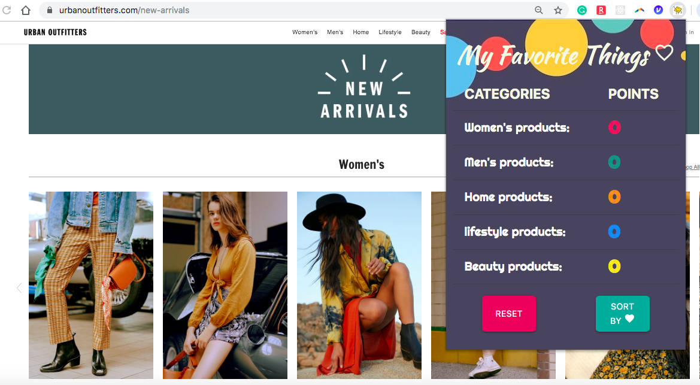
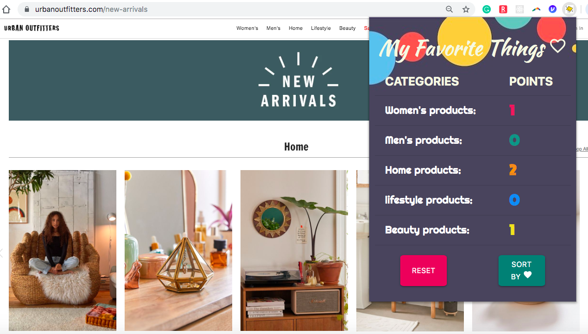

## Affinity-extension or Happy Shopper  
### What is it?
This is a Chrome extension that provides a unique and efficient shopping experience at [Urban Outfitters](https://www.urbanoutfitters.com/new-arrivals) website.
It tracks every product category of a visited page and adds points to the Product Category Section in your tab extension. 

### What does it do?
It can automatically adjust the page view of a [New Arrivals](https://www.urbanoutfitters.com/new-arrivals) section at the urbanoutfitters website based on the highest score among visited pages. 
You can also adjust the page view manually by pressing 'SORT BY Favorite' button in your affinity extension. 

### What if my grandmother ruined my affinity points?
In case if your grandma were searching for mittens or cat rugs while you were not at home and now the most popular category in your extension is home but your heart's calling for Men's new arrivals category, simply press the reset button and start your unique shopping experience from the clean slate.

### Structure

### License
Affinity-extension is available under the MIT license. See the [LICENSE](LICENSE.md) file for more info.

# Have fun!
